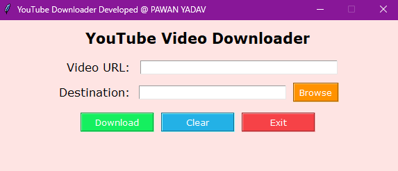

# 🎵 YouTube Video Downloader

A simple and user-friendly desktop GUI application built with **Python Tkinter** and **yt-dlp** to download high-quality MP4 Video with clear audio from YouTube links.

---

## 🚀 Features

- 🎯 Download best-quality video with clear audio (MP4 format) from any valid YouTube video URL.
- 📁 Browse and select your desired download directory.
- ✅ Easy-to-use interface with message alerts.
- 🔁 Option to clear/reset inputs.
- ❌ Close/Exit the app with a click.
- 🖼️ Clean and modern GUI using `tkinter`.

---

## 📂 Options to Use

### ✅ Option 1: Use the Standalone Executable (`Video_Download.exe`)

> No Python installation needed! Just download and run the file.

1. [Download `Video_Download.exe`](./Video_Download.exe)
2. Double-click to launch the YouTube Music Downloader.
3. Paste the YouTube link, choose a folder, and hit **Download Music**.

> ⚠️ Make sure FFmpeg is present in your system or bundled with the EXE. If needed, extract [FFmpeg](https://www.ffmpeg.org/download.html) and place the `ffmpeg_path = r"D:\Software\ffmpeg-master-latest-win64-gpl\ffmpeg-master-latest-win64-gpl\bin"
` path in the script before compiling.

---

### 🐍 Option 2: Run the Script Locally (For Developers)

#### Requirements:

- Python 3.x  
- `yt-dlp`  
- `ffmpeg`

## 🔧 Installation

### 1. Clone the repository
    ```bash
    git clone https://github.com/2000pawan/Youtube-Music-Download-.git
    cd youtube-video-downloader

### 2. Install dependencies

    pip install yt-dlp

### 3. Download FFmpeg
     Download the latest FFmpeg static build from:
     👉 https://www.gyan.dev/ffmpeg/builds/

    Extract and copy the path of the ffmpeg/bin folder (e.g., D:/Software/ffmpeg/bin), then update it in the script under ffmpeg_path.

## 🧠 Usage
Run the script:

python video_downloader.py

Paste a YouTube video URL.

Click Browse and select the destination folder.

Click Download Music.

Enjoy your video saved!

## 🖥️ GUI Screenshot


## 🧑‍💻 Developer

Pawan Yadav


## 📜 License


This project is open-source and free to use under the MIT License.
